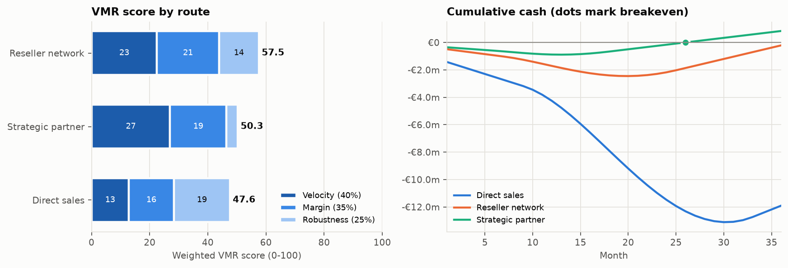
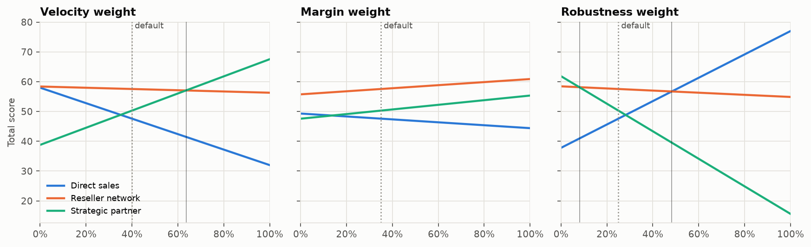
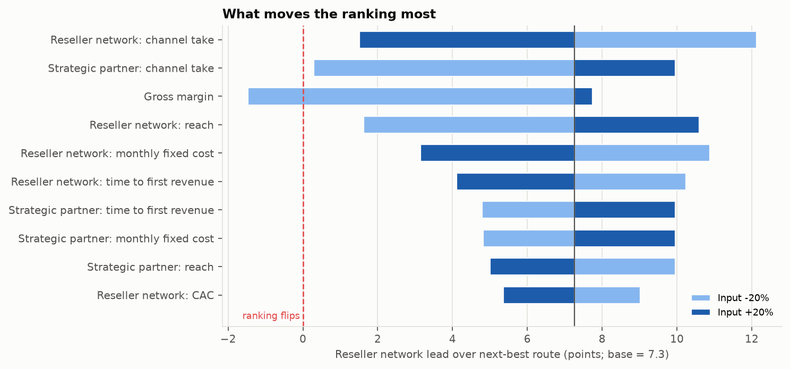

# Route-to-Market Decision Tool

**Question:** Which route should a mid-market B2B software company use to enter a new European country: direct sales, a reseller network or a strategic partner?

**Recommendation:** Enter through the **reseller network**. It scores 58/100 on Velocity, Margin and Robustness (VMR), against 50 for a strategic partner and 48 for direct sales. It is the only route with no weak dimension.

**How sure:** It ranks first in 54% of all possible weightings and still ranks first in the downside case. The answer changes if resellers demand a margin above ~38% (30% assumed).



*Left: each route's total, split into weighted Velocity, Margin and Robustness points. Right: cumulative cash over 36 months. The partner pays back first (month 26) but keeps the least of each euro and stakes everything on one relationship. Direct sales is the most robust but needs €13m of funding and does not pay back within five years.*

The one-page executive summary is in [`docs/one_page_summary.pdf`](docs/one_page_summary.pdf).

---

## What the analysis found

| Route | Velocity | Margin | Robustness | **VMR total** | Breakeven | Peak funding |
|---|---:|---:|---:|---:|---|---:|
| Reseller network | 56 | 61 | 55 | **57.5** | month 37 (projected) | €2.5m |
| Strategic partner | 68 | 55 | 16 | **50.3** | month 26 | €0.9m |
| Direct sales | 32 | 44 | 77 | **47.6** | month 79 (projected) | €13.1m |

Weights: Velocity 40%, Margin 35%, Robustness 25%. Scores are 0-100.

1. **The trade-off is real.** Each route wins one dimension: the partner is fastest, resellers keep the most margin, and direct sales is the most robust. Resellers win overall because they are second on Velocity and Robustness and first on Margin.
2. **The partner route is fast but fragile.** It breaks even first, but 100% of revenue runs through one company under a three-year exclusive deal. In the downside case (market 30% smaller and the partner walking away in month 18) it keeps only 51% of its base-case revenue, against 63% for resellers and 70% for direct sales.
3. **Direct sales is safe but slow and expensive.** It needs €13m of funding before it pays back, which the model projects at around month 79.

### When the answer changes



| Condition | New top route |
|---|---|
| Velocity weight above 64% (default 40%) | Strategic partner |
| Robustness weight above 48% (default 25%) | Direct sales |
| Robustness weight below 8% (default 25%) | Strategic partner |
| Reseller margin 25% higher than assumed (30% to 38%) | Strategic partner |
| Partner revenue share 22% lower than assumed (45% to 35%) | Strategic partner |
| Gross margin 18% lower than assumed (78% to 64%) | Direct sales |
| Downside case: market -30% and the main intermediary lost in month 18 | *No change* |



The two channel takes are the assumptions to test first: they move the ranking more than market size, CAC or timing. The full generated recommendation, including the top three risks and next steps, is in [`docs/results.md`](docs/results.md).

## Method

1. **Financial model.** Each route is projected month by month for 36 months. Revenue ramps on an S-curve from the route's first-revenue month. The route then pays its channel take, customer acquisition cost (CAC) and fixed costs. This gives the cash curve, breakeven month, peak funding and margins.
2. **VMR scoring.** Nine metrics (three to four per dimension) are each scaled 0-100 between fixed "worst" and "best" anchors. They are averaged within each dimension, then combined with the 40/35/25 weights. `python -m rtm` prints every step.
3. **Sensitivity.** A weight sweep and a map of every weight combination, a ±20% tornado on every input, a search for the input change that flips the ranking, and a downside case with a market shock plus the loss of the main intermediary.
4. **Recommendation.** The text is generated from the results by rules, so it always matches the numbers.

Formulas and judgment calls: [`docs/methodology.md`](docs/methodology.md). The hypothesis tree behind the three dimensions is in [`docs/hypothesis_tree.md`](docs/hypothesis_tree.md).

## Assumptions and limitations

- **All data is synthetic.** It describes a hypothetical company, not a client. Every input in [`data/scenario.yaml`](data/scenario.yaml) has a `source` field with its rationale, and the loader rejects any input without one.
- **Some choices are judgment calls, and the docs say so.** These include the scoring anchors, the concentration-risk rating, the Margin split between run-rate and cumulative, and projecting breakeven beyond 36 months at the final month's cash flow.
- **Routes are compared as alternatives.** A hybrid model (for example resellers plus a small key-account team) is not modelled.
- **Tornado inputs move one at a time.** The downside case is the only test where several things go wrong together.
- **Cash is not discounted.** Over three years this shifts the numbers slightly but not the ranking.

## How to run

```bash
git clone https://github.com/mannankhanduja-max/route-to-market-tool.git && cd route-to-market-tool
pip install -r requirements.txt
streamlit run app.py
```

The dashboard has sliders for the weights and the key assumptions, and re-runs the whole model live. Other commands: `make test` (unit tests), `make lint` (ruff), `make report` (prints the workings and rebuilds the figures, `docs/results.md` and the PDF). To test a different market, edit `data/scenario.yaml`.

## Repository layout

```
data/scenario.yaml        every assumption, each with a source or rationale
src/rtm/config.py         loads and validates the scenario
src/rtm/finance.py        revenue ramp, cash curve, breakeven
src/rtm/scoring.py        VMR scores, weights, ranking, workings table
src/rtm/sensitivity.py    weight sweep, weight map, tornado, flip thresholds, downside
src/rtm/recommend.py      plain-English recommendation
src/rtm/charts.py         charts shared by the app, README and PDF
app.py                    Streamlit dashboard
scripts/build_report.py   regenerates docs/figures, docs/results.md, docs/one_page_summary.pdf
tests/                    unit tests for config, finance, scoring, sensitivity, recommendation, app
```

Python 3.11+. Dependencies: numpy, pandas, matplotlib, streamlit, pyyaml, pytest, ruff. MIT licence.
